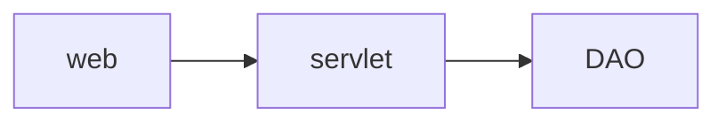

# JAVA Enterprise Edition

## Core idea - MVC

model, view and controller. 

|            |    JAVA EE    | SSH  |
| :--------: | :-----------: | ---- |
|   model    | **java bean** |      |
|    view    |    **jsp**    |      |
| controller |  **servlet**  |      |

web, servlet, dao

- Struts2, Spring, Hibernate
- SpringMVC, Spring, Mybaties

